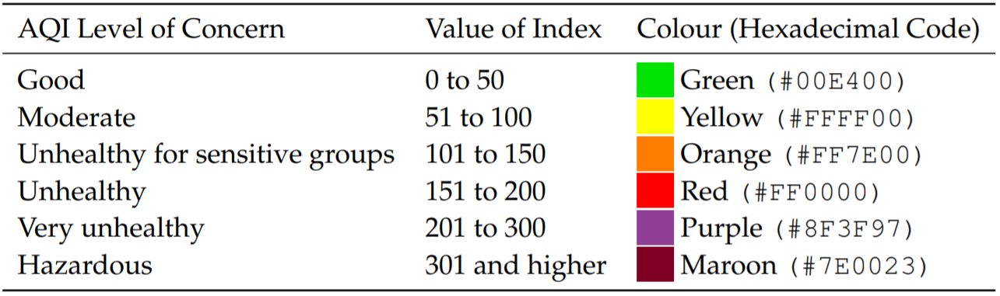
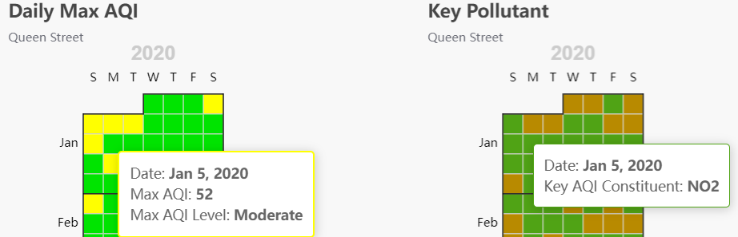
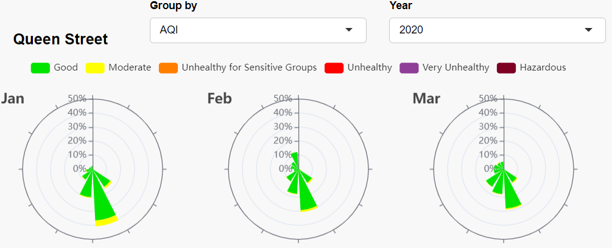
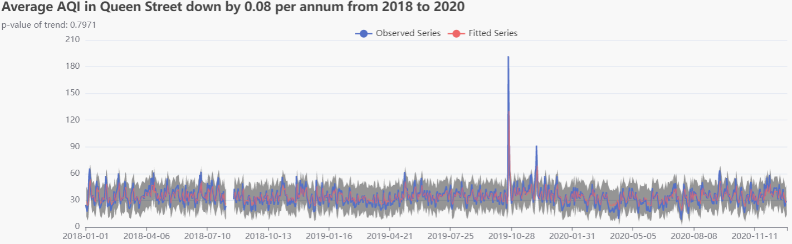
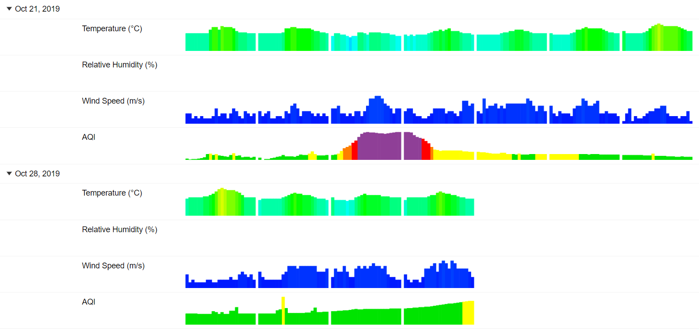
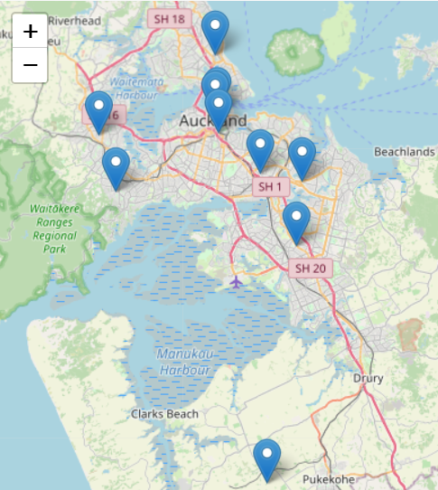
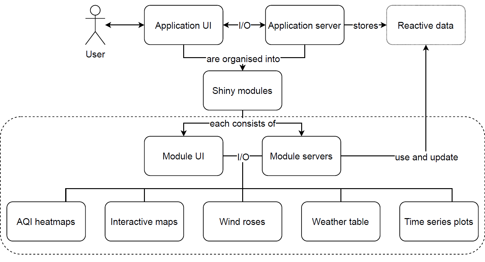

```{r setup, echo = FALSE, cache = FALSE, results = 'hide'}
library(knitr)
options(
  htmltools.dir.version = FALSE, htmltools.preserve.raw = FALSE,
  tibble.width = 60, tibble.print_min = 6
)
opts_chunk$set(
  echo = FALSE, warning = FALSE, message = FALSE, comment = "#>", fig.retina = 3,
  fig.align = "center", fig.show = "hold", cache.path = "cache/", cache = TRUE,
  dpi = 110, dev.args = list(png = list(type = "cairo"))
)
```

```{r xaringan-themer, include = FALSE, warning = FALSE}
library(xaringanthemer)
style_mono_accent(
  base_color = "#035AA6",
  header_font_google = google_font("Josefin Sans"),
  text_font_google = google_font("Montserrat", "400", "400i"),
  code_font_google = google_font("Fira Mono")
)
```

## Auckland air quality

* New Zealand is well-known for the clean air.

* Maintaining the reputation needs continuous monitoring.

  * Auckland Council's air quality management plan

* Main metric: air quality index (AQI)

```{r aqi-cat, out.width = "95%", fig.align = "center"}

```

* Data source: Auckland Regional Council

---

## A static visualisation

```{r static-plot, fig.align = "center", fig.height = 4.3}
library(dplyr)
library(ggplot2)
"../data/slide-data.csv" %>%
  readr::read_csv(col_types = "Td") %>%
  ggplot(aes(datetime, aqi)) +
  geom_ribbon(aes(ymin = 0, ymax = 50.5), fill = "#00E400", alpha = .5) +
  geom_ribbon(aes(ymin = 50.5, ymax = 100.5), fill = "#FFFF00", alpha = .5) +
  geom_ribbon(aes(ymin = 100.5, ymax = 150.5), fill = "#FF7E00", alpha = .5) +
  geom_ribbon(aes(ymin = 150.5, ymax = 200.5), fill = "#FF0000", alpha = .5) +
  geom_ribbon(aes(ymin = 200.5, ymax = 300.5), fill = "#8F3F97", alpha = .5) +
  geom_line(size = .2) +
  theme_bw() +
  labs(
    title = "AQI observed in Queen Street since 2016",
    x = "Date time", y = "AQI"
  )
```

---

class: center middle
background-image: url(../figures/aqi-tab.png)
background-size: 100%

# Live demo: [bit.ly/akl-aqi](https://bit.ly/akl-aqi)

---

class: center

## Interactive graphics implemented

--

.pull-left[
[**echarts4r**](https://github.com/JohnCoene/echarts4r)

```{r out.width = "95%"}

```
<br>
```{r out.width = "95%"}

```
<br>
```{r out.width = "95%"}

```
]

--

.pull-left[
[**reactable**](https://github.com/glin/reactable)
```{r out.width = "80%"}

```
]

--

.pull-left[
[**leaflet**](https://github.com/rstudio/leaflet)
```{r out.width = "55%"}

```
]

---

## A modularised shiny application

<br>

```{r app-structure, out.width = "95%", fig.align = "center"}

```

---

## Shiny modules

If the application is developed as a whole, the codebase would become chunky and unmanageable.

```r
e <- e_charts(data, ...) # Data for which chart?
e_chart_1 <- echarts(data_for_chart_1, ...)
e_chart_2 <- echarts(data_for_chart_2, ...)
```
<hr>
### Modularisation comes to rescue

* Each interactive graphic is encapsulated as a module.

* The dashboard consists of a collection of interactive graphics.

* Modularisation facilitates easy maintenance and extensibility

---

## Shiny module example: the map

.pull-left[
<br>

```{r out.width = "85%"}

```
]

.pull-right[
<br>

```r
map_aqi_ui <- function(id) {
  # Unique namespace
  ns <- NS(id)
  # Call for graphics output
  leafletOutput(ns("map_aqi"))
}

map_aqi_mod <-
  function(id, state) {
    module <-
      function(...) {
        ## Render graphics output
      }
    # Run with unique namespace
    moduleServer(id, module)
  }
```
]

---

## A shiny module <i class="fas fa-cube"></i>

.pull-left[
<br>

* Consists of its own UI and server

<br>

* Represents an encapsulated **R** environment

  * Has dedicated and isolated namespace

  * Does not interfere with other modules
]

.pull-right[
<br>

```r
map_aqi_ui <- function(id) {
  # Unique namespace
  ns <- NS(id)
  # Call for graphics output
  leafletOutput(ns("map_aqi"))
}

map_aqi_mod <-
  function(id, state) {
    module <-
      function(...) {
        ## Render graphics output
      }
    # Run with unique namespace
    moduleServer(id, module)
  }
```
]

---

## Assembling modules <i class="fas fa-cubes"></i>

#### Application server

```{r eval = FALSE, echo = TRUE}
app_server <- function(input, output, session) {
  ## Other shiny module servers
  map_aqi_mod("map_aqi", app_state) #<<
  ## Other server codes
}
```

#### Application UI

```{r eval = FALSE, echo = TRUE}
app_ui <- dashboardPage(
  header, sidebar,
  body = dashboardBody(
    tabItem(tabName,
      fluidRow(column(map_aqi_ui("map_aqi"))), #<<
      ## Other modular UI
    ),
    ## Other tabs
  )
)
```

---

class: middle center inverse

# If the modules are isolated, how do they communicate?

---

## Event-driven module communication

* A shiny reactive `app_state` stores the snapshot of the current session.

```r
app_state <- reactiveValues(data, user_clicks, cached_graphics, ...)
```

<br>

* The shiny application "reacts" to events;

  * e.g., when a user clicks on a station on the interactive map:

```{r eval = FALSE, echo = TRUE}
map_aqi_mod <- function(id, state) {
  module <- function(input, output, session) {
    ## Shiny output
    observeEvent(input[["map_aqi_marker_click"]], { #<<
      state[["map_onclick"]] <- input[["map_aqi_marker_click"]][["id"]] #<<
    }) #<<
  }
  moduleServer(id, module)
}
```

---

class: middle

```{r app-structure-2, out.width = "95%", fig.align = "center"}

```

---

## Shiny reactive <i class="far fa-hand-pointer"></i>

```r
app_state <- reactiveValues(data, user_clicks, cached_graphics, ...)
```

* Has only one collection of values at any time;

<br>

* Is evaluated only when its value is updated;

<br>

* Is cached;

<br>

* Can be updated by "reacting" to an event.

---

class: middle center inverse

# BTS: How can we keep the app performant with > 1M observations of data?

---

## Data caching

.pull-left[
* Loads data on demand

<br>

* Uses reactives

<br>

* Detects user clicks as events

<br>

* Checks if data for the clicked-location is loaded

<br>

* Load data if not already loaded
]

.pull-right[
```r
append_data <-
  function(data, loc) {
    ## Load new data for loc,
    ## then return new data set
    ## by binding new data
    ## to the old data
  }

app_server <- function(...) {
  ## Shiny module servers
  ## Other server codes
  observeEvent(map_click, {
    if (!data_is_loaded) {
      app_state[["data"]] <-
        append_data(...)
    }
  })
}
```
]

---

## Graphics caching

* Saves rendering time

<br>

* Temporarily saving rendered graphics for the session in the memory

<br>

* Uses shiny function `bindCache()`

```{r eval = FALSE, echo = TRUE}
aqi_heatmap_mod <- function(id, state = app_state) {
  module <- function(input, output, session) {
    ## Reactivity and event handling
    ## Data processing
    output[["aqi_heatmap"]] <- renderEcharts4r(expr) %>%
      bindCache(...) #<<
  }
  moduleServer(id, module)
}
```

---

## Project contribution

* This project delivers an insightful storytelling dashboard.

* It is accessible to the public via [bit.ly/akl-aqi](https://bit.ly/akl-aqi).

* Approaches exploration of Auckland air quality in multiple aspects.

* Various interactive graphics are integrated into one web application.

* The graphics are modularised but linked with user interaction.

<hr><br>

#### Open and reproducible research

* Dissertation: https://github.com/szmsu2011/hons-dissertation

* Application source code: https://github.com/szmsu2011/akl-air-quality

---

class: middle center

# Explore on your own
### [bit.ly/akl-aqi](https://bit.ly/akl-aqi)
